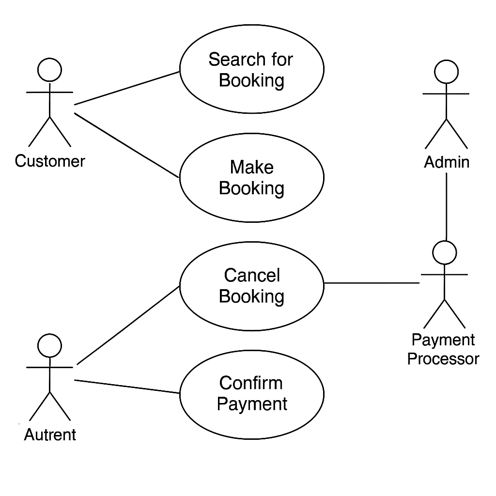

# requirement-analysis
What is Requirement Analysis?
Requirement prioritization is based on their importance and impact on the project.
feasibility analysis is assessing the feasibility of requirements in terms of technical, financial and time constraints.
modeling is creating models ( e.g , data flow diagrams, entity relationship diagrams) to visualize and analyze requirements.
Why is Requirement Analysis Important?
Clarity and understanding: it helps in understanding what the stakeholders expect from the software reducing ambiguity.
Scope definition: clearly defines the scope of the project, which helps in preventing scope creep.
Basis for design and development: provides a solid foundation for designing and developing the system.
Key Activities in Requirement Analysis.
- Requirement Gathering: Interviews: Conducting interviews with stakeholders to gather detailed information about their needs and expectations.
Surveys/Questionnaires: Distributing surveys to collect requirements from a larger audience.
Workshops: Organizing workshops with stakeholders to discuss and gather requirements.
Observation: Observing end-users in their working environment to understand their needs.
Document Analysis: Reviewing existing documentation and systems to understand current functionalities and requirements.
-Requirement Elicitation: Brainstorming: Conducting brainstorming sessions to generate ideas and gather requirements.
Focus Groups: Holding focus group discussions with selected stakeholders to gather detailed requirements.
Prototyping: Creating prototypes to help stakeholders visualize the system and refine their requirements.
-Requirement Documentation: Requirement Specification Document: Creating a detailed document that lists all functional and non-functional requirements.
User Stories: Writing user stories to describe functionalities from the user’s perspective.
Use Cases: Creating use case diagrams to show interactions between users and the system.
-Requirement Analysis and Modeling: Requirement Prioritization: Prioritizing requirements based on their importance and impact on the project.
Feasibility Analysis: Assessing the feasibility of requirements in terms of technical, financial, and time constraints.
Modeling: Creating models (e.g., data flow diagrams, entity-relationship diagrams) to visualize and analyze requirements.
-Requirement Validation: Review and Approval: Reviewing the documented requirements with stakeholders to ensure accuracy and completeness.
Acceptance Criteria: Defining clear acceptance criteria for each requirement to ensure they meet the expected standards.
Traceability: Establishing traceability matrices to ensure all requirements are addressed during development and testing.
Types of Requirements
Functional Requirements
Search Properties: Users should be able to search for properties based on various criteria such as location, price, and availability.
Booking System: Users should be able to book properties, view booking details, and manage their bookings.
Non-functional Requirements
Usability: The application should have an intuitive UI/UX, making it easy for users to navigate and perform tasks.
Use Case Diagrams
Use Case Diagrams are a type of UML (Unified Modeling Language) diagram used during the Requirement Analysis phase of software development.
 Benefit	and Explanation
Clarifies System Scope	Defines what the system will and will not do.
Improves Communication	Helps non-technical stakeholders understand how the system works.
Captures User Expectations	Ensures user goals are clearly defined early in the process.
Supports Validation of Features	Stakeholders can verify if the system includes all required use cases.
Organizes Functional Requirements	Breaks down high-level functionality into smaller, manageable parts.
Aids Development Planning	Helps development teams estimate work and plan implementation.
Booking System Use Case Diagram

from pathlib import Path

# Define input and output paths
input_path = Path("/mnt/data/A_UML_(Unified_Modeling_Language)_use_case_diagram.png")
output_path = Path("/mnt/data/alx-booking-uc.png")

# Copy the image with the new name
shutil.copy(input_path, output_path)

